<div align="center">

# BOTTLE CRATE INSPECTION USING OPENCV

</div>

#### This project provides a tool to analyze the quality of crates with classical image processing techniques using OpenCV.

<br>
<br>
<div align="center">

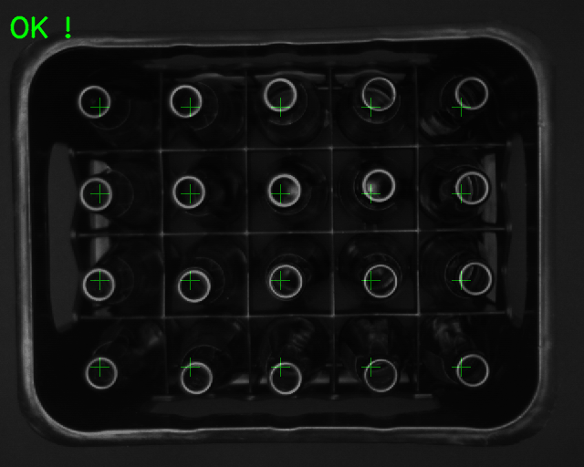


<br>

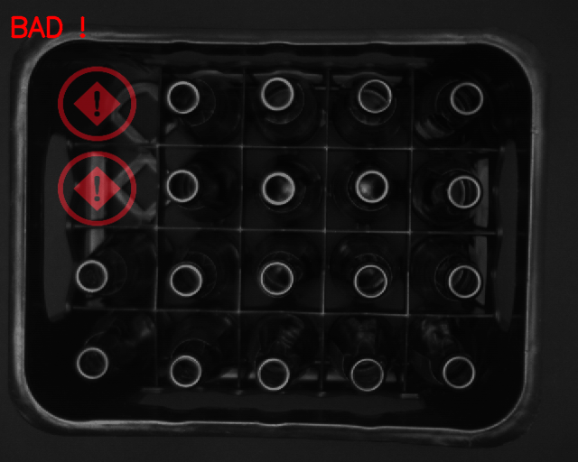 

</div>
<br>
<br>

<div align="center">
    <table>
        <tr>
            <td></td>
            <td>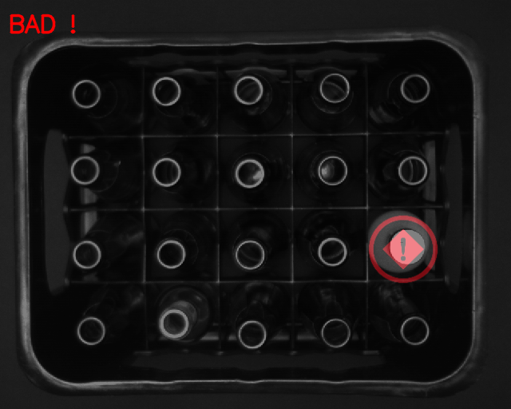</td>
            <td>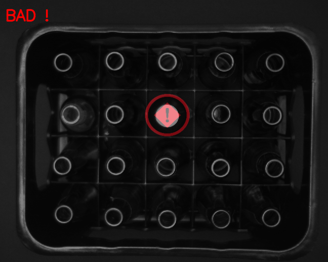</td>
        </tr>
        <tr>
            <td>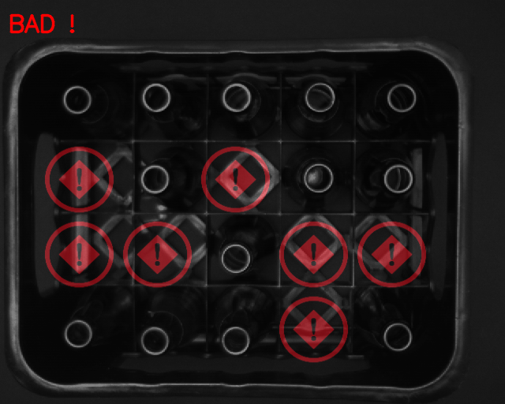</td>
            <td>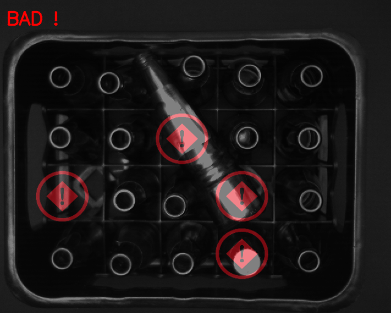</td>
            <td>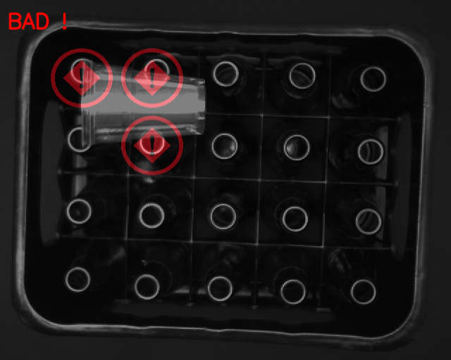</td>
        </tr>
        <tr>       
            <td>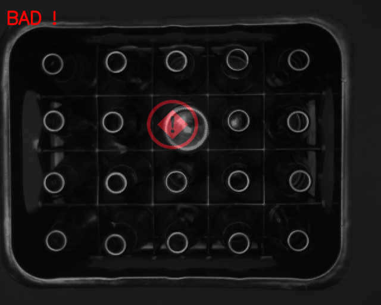</td>
            <td>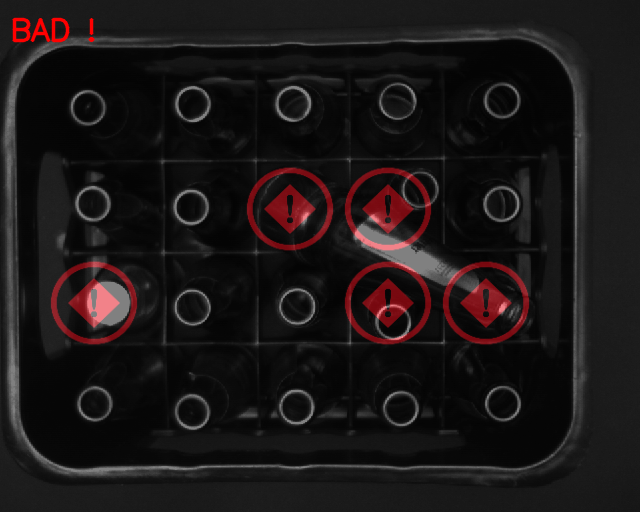</td>
            <td>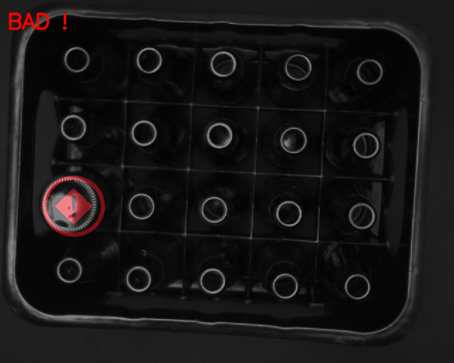</td>
        </tr>
        <tr>
            <td>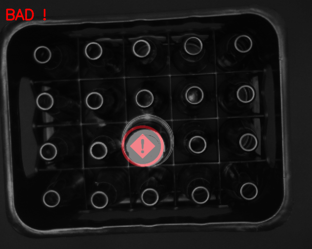</td>
            <td>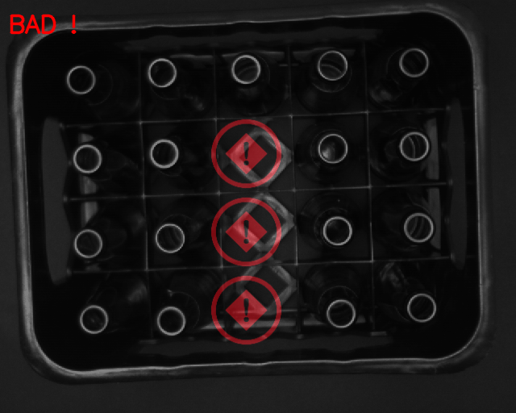</td>
            <td>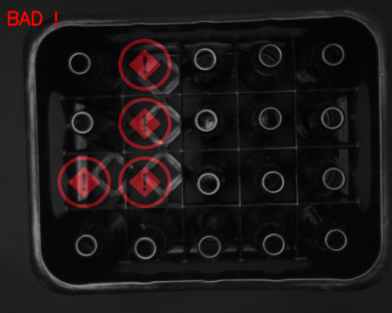</td>
        </tr>
        <tr>
            <td>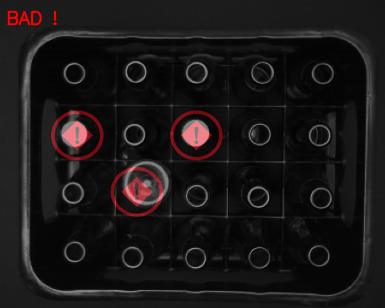</td>
            <td>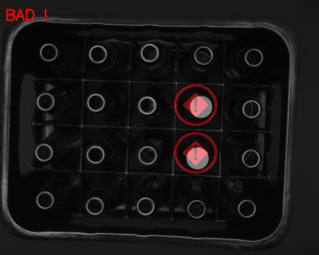</td>
            <td>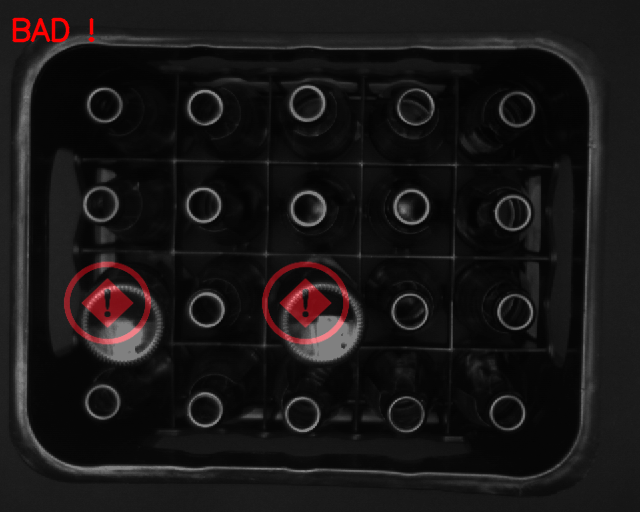</td>
        </tr>
        <tr>
            <td>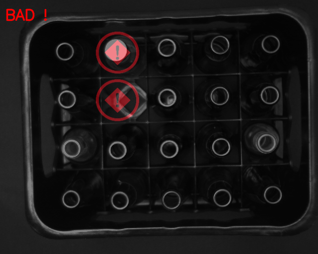</td>
            <td></td>
            <td>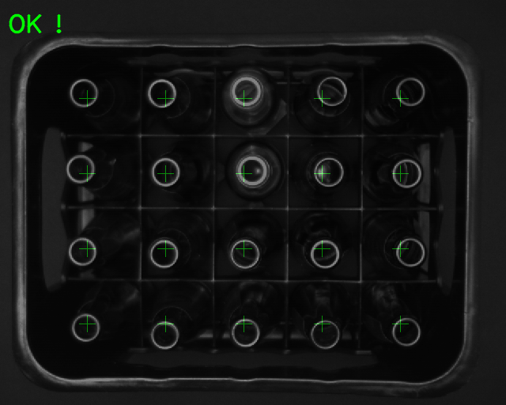</td>
        </tr>
        <tr>
            <td>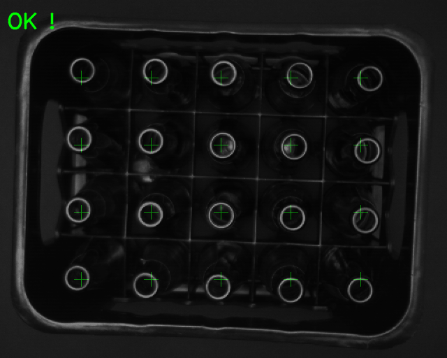</td>
            <td>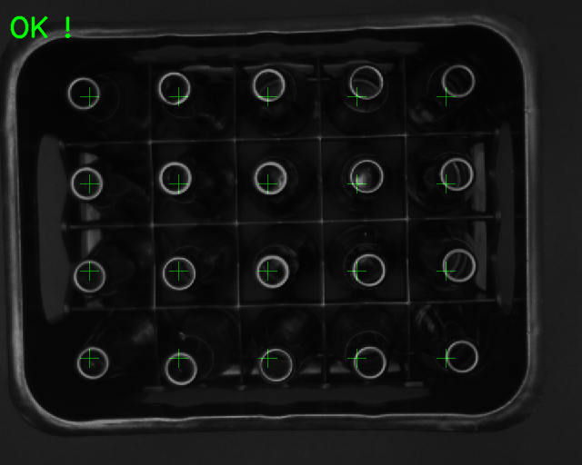</td>
        </tr>
    </table>

</div>

<br>
<br>

## Features

- Analyzes the quality of a crate based on an image.
- Outputs the quality of the crate and displays the processed image.

## Requirements

- OpenCV
- PyYAML

## Usage

To use the Crate Quality Analyzer, you need to provide an image of the crate as a command-line argument:

```sh
python3 inspect_crate.py <image_path>
```

This will output the quality of the crate and display the processed image.`

## Configuration

The settings for the image processing parameters can be configured in the [settings.yaml](config/setting.yaml) file.Here you can set parameters for the Canny edge detection, Hough Circle Transform, image dimensions, crate dimensions, template matching, and more.
